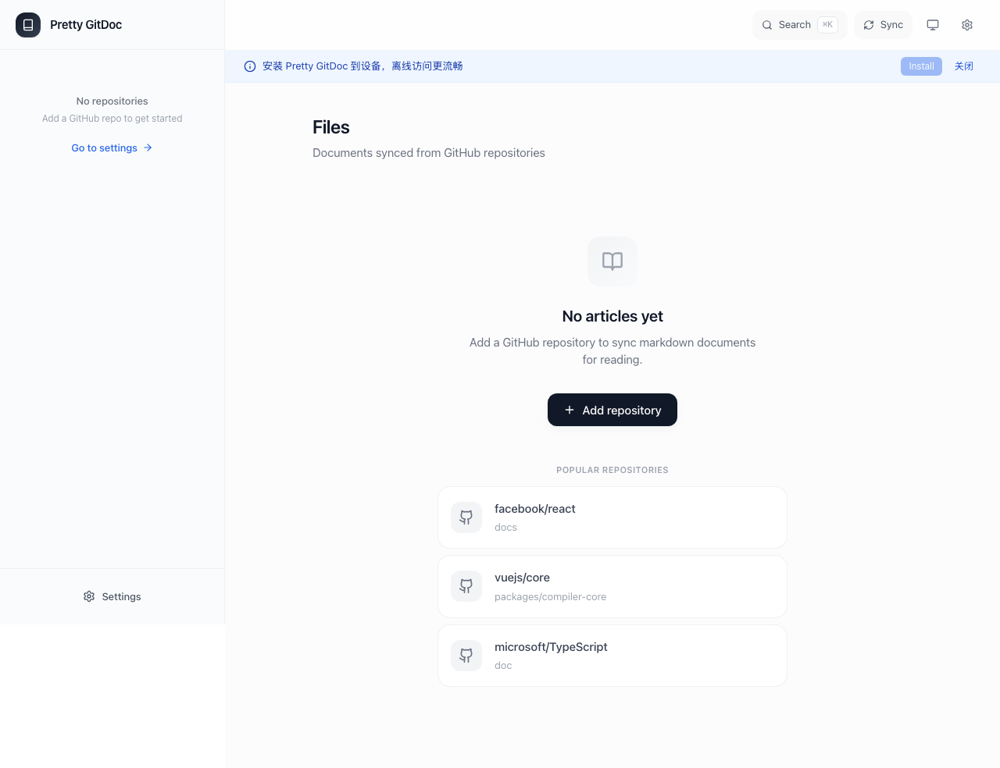
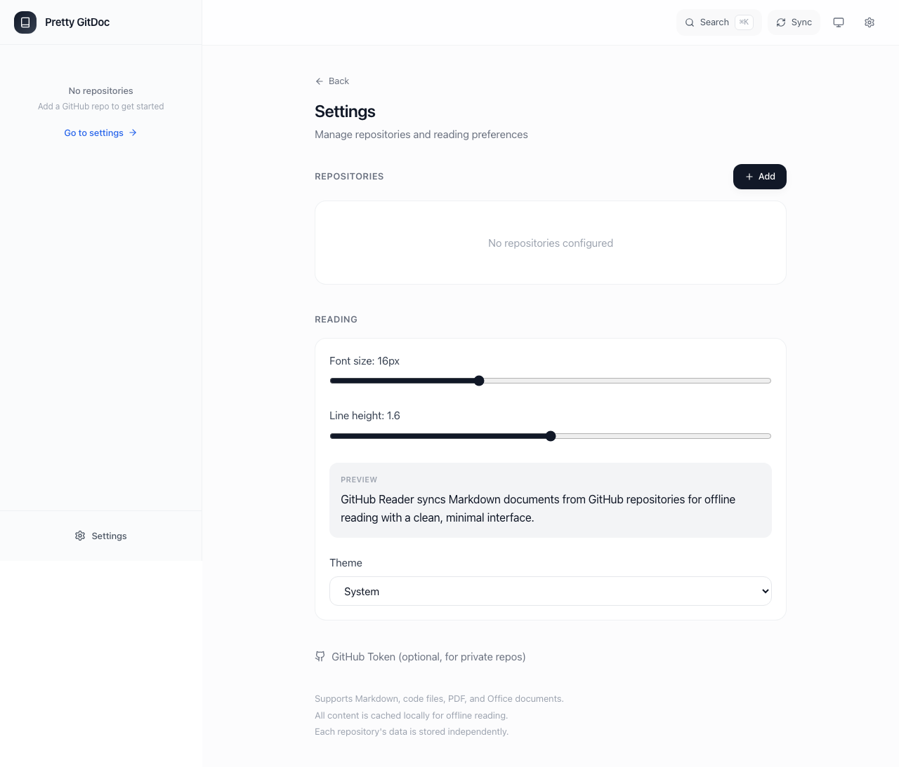
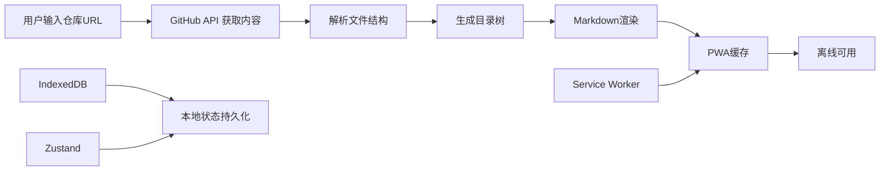

<div align="center">

# Pretty GitDoc

> GitHub 仓库即知识库 · 优雅阅读 · 一键安装 PWA (v1.0.0)



### 您的优雅文档阅读器

不仅是文档浏览器，更是将 GitHub 仓库转化为精美知识库的终极解决方案。


核心功能 •
界面导览 •
技术架构 •
安装指南 •
快速接入

__简体中文__ |
[English](./README_EN.md)

---

</div>

__Pretty GitDoc__ 是 Obsidian 用户的最佳伴侣，专为移动端知识管理而生。

只需输入 Git 仓库链接，即可在手机上优雅浏览您的 Obsidian 笔记库。无论您是在地铁上复习笔记，还是想与朋友分享知识库，Pretty GitDoc 都能让您的 Markdown 仓库随时随地触手可及。

**核心场景**: 在电脑上用 Obsidian 写笔记 → 推送到 GitHub → 手机上用 Pretty GitDoc 查看 → 分享链接给朋友直接阅读

## 🌟 深度功能解析 (Detailed Features)

### 1. 🔗 一键 Git 输入，随时随地查看 (Git to Mobile)

- __极简操作__: 输入 Git 仓库链接，一键加载，无需复杂配置
- __Obsidian 完美兼容__: 专为 Obsidian 笔记库优化，支持 Wikilinks、Front Matter、Callouts 等语法
- **移动优先**: PWA 设计，手机上体验流畅如原生 App
- **分享便捷**: 将链接分享给朋友，对方无需安装即可直接在浏览器中查看您的知识库

### 2. 📖 优雅阅读体验 (Elegant Reading Experience)

- __Markdown 渲染__: 完整支持 GFM (GitHub Flavored Markdown)，包括表格、任务列表、脚注等
- __代码高亮__: 内置多主题语法高亮，支持 100+ 编程语言
- __TOC 目录__: 自动生成文档目录，支持锚点跳转
- __PDF 预览__: 内嵌 PDF 查看器，无需跳转即可阅读
- __DOCX 转 HTML__: 自动转换 Word 文档，保持原有格式

### 3. 📱 PWA 离线支持 (Offline-First PWA)

- __Service Worker__: 生产版启用 Serwist 缓存策略
- __离线可用__: 缓存已访问内容，无网络时仍可阅读
- __一键安装__: 支持添加到主屏幕，像原生 App 一样使用

### 4. 🔗 分享与同步 (Share & Sync)

- __Web Share__: 一键分享当前页面，调用系统原生分享
- __链接复制__: 不支持 Web Share 时自动回退到复制链接
- __本地缓存__: Zustand + IndexedDB 双重缓存，数据永不丢失

## 📸 界面导览 (GUI Overview)

| | |
| --- | --- |
|  首页 |  设置页 |

### 💡 使用案例 (Usage Examples)

- __Obsidian 笔记移动查看__: 在电脑上用 Obsidian 写笔记，推送到 GitHub 后，手机上随时查看
- __知识分享__: 将您的知识库链接分享给朋友，对方无需安装 Obsidian 即可阅读
- __技术文档阅读__: 浏览开源项目文档，享受舒适的移动端阅读体验
- __团队协作__: 团队成员共享文档仓库，统一的移动端阅读入口
- __学习笔记__: 整理学习资料，通勤路上随时查阅

## 🏗️ 技术架构 (Architecture)



## 安装指南 (Installation)

### 选项 A: 从 Releases 下载桌面版

前往 GitHub Releases 下载对应平台的安装包：

| 平台 | 格式 | 说明 |
| --- | --- | --- |
| __macOS (Apple Silicon)__ | `.dmg` | M1/M2/M3 芯片 |
| __macOS (Intel)__ | `.dmg` | Intel 芯片 |
| __Windows__ | `.exe` / `.msi` | 安装包或便携版 |
| __Linux__ | `.deb` / `.AppImage` | Debian/Ubuntu 或通用 |

> **下载地址**: [GitHub Releases](https://github.com/frankfika/prettygitdoc/releases)

**macOS 用户首次安装后需要运行**（绕过 Gatekeeper 检查）：
```bash
xattr -cr /Applications/Pretty\ GitDoc.app
```

### 选项 B: PWA 安装 (移动端推荐)

Pretty GitDoc 是一个 PWA 应用，可在任何设备上像原生 App 一样安装使用：

| 平台 | 安装方式 |
| --- | --- |
| __iOS__ | Safari → 分享 → 添加到主屏幕 |
| __Android__ | Chrome → 菜单 → 安装应用 / 添加到主屏幕 |

**安装步骤**:
1. 在浏览器中打开: https://prettygitdoc.vercel.app
2. 根据上表方式添加到设备
3. 像原生 App 一样使用，支持离线访问

### 选项 C: 在线体验

无需安装，直接访问：

> **在线地址**: https://prettygitdoc.vercel.app

### 选项 D: Vercel 一键部署

[](https://vercel.com/new/clone?repository-url=https://github.com/frankfika/prettygitdoc)

### 选项 E: 本地开发

```bash
# 克隆仓库
git clone https://github.com/frankfika/prettygitdoc.git
cd prettygitdoc

# 安装依赖
npm install

# 启动开发服务器
npm run dev# http://localhost:3000
```

## 🔌 快速接入示例

### Obsidian + Pretty GitDoc 工作流 (推荐)

1. **在电脑上**: 用 Obsidian 编写笔记，推送到 GitHub 仓库
2. **在手机上**: 打开 Pretty GitDoc，输入您的 Obsidian 仓库链接
3. **随时随地**: 在手机上优雅阅读笔记，无需安装任何 App
4. **一键分享**: 复制链接发给朋友，对方直接在浏览器中查看

### 访问公开仓库

1. 打开应用首页
2. 输入 GitHub 仓库 URL，例如：
   - `https://github.com/vercel/next.js`
   - `https://github.com/facebook/react/tree/main/packages`
3. 点击"加载"按钮，自动解析并展示目录

### 访问私有仓库

1. 在 GitHub 生成 Personal Access Token (需要 `repo` 权限)
2. 打开应用设置页面
3. 将 Token 填入"GitHub Token"输入框
4. 保存后即可访问私有仓库

### 配置示例

```typescript
// 在浏览器控制台或代码中配置
localStorage.setItem('github-token', 'ghp_your_token_here');
```

## 📁 目录结构 (Directory Structure)

```
prettygitdoc/
├── app/                    # Next.js App Router 页面
│   ├── page.tsx           # 首页
│   ├── settings/          # 设置页
│   └── layout.tsx         # 根布局
├── components/             # UI 组件
│   ├── reader/            # 文档阅读器
│   └── markdown/          # Markdown 渲染器
├── lib/                    # 核心库
│   ├── github.ts          # GitHub API 封装
│   └── cache.ts           # 缓存管理
├── public/                 # 静态资源
│   ├── manifest.json      # PWA 配置
│   └── sw.js              # Service Worker
├── docs/                   # 项目文档
│   ├── product.md         # 产品文档
│   └── skills/            # Claude Code Skills
└── .github/               # GitHub 配置
    └── workflows/         # CI/CD 工作流
```

## 🚀 构建与发布 (Build & Deploy)

### PWA 部署 (Vercel 推荐)

```bash
# 构建生产版本
npm run build

# 启动生产服务器
npm run start
```

Vercel 一键部署会自动：
- 识别 Next.js 框架
- 配置 HTTPS 和 CDN
- 启用 PWA 缓存策略
- 生成 Service Worker

### 自托管部署

```bash
# Docker 构建
docker build -t prettygitdoc .
docker run -p 3000:3000 prettygitdoc
```

## 📝 开发者与社区

### 版本演进 (Changelog)

- __v1.0.0 (2026-02-16)__:
  - 初始发布
  - 支持 GitHub 仓库解析
  - Markdown 渲染与代码高亮
  - PWA 离线支持
  - 多平台部署方案

### 贡献指南

欢迎提交 Issue 和 Pull Request！

1. Fork 本仓库
2. 创建特性分支 (`git checkout -b feature/AmazingFeature`)
3. 提交更改 (`git commit -m 'Add some AmazingFeature'`)
4. 推送到分支 (`git push origin feature/AmazingFeature`)
5. 创建 Pull Request

## 📄 文档与资源

- **产品文档**: [docs/product.md](./docs/product.md)
- **Claude Code Skill**: [docs/skills/claude-code/prettygitdoc.skill.yaml](./docs/skills/claude-code/prettygitdoc.skill.yaml)
- **API 文档**: [即将推出]

## 🤝 鸣谢项目 (Special Thanks)

本项目在开发过程中参考或借鉴了以下优秀开源项目：

- [Next.js](https://nextjs.org/) - React 框架
- [Serwist](https://serwist.pages.dev/) - PWA 解决方案
- [Zustand](https://github.com/pmndrs/zustand) - 状态管理
- [React Markdown](https://github.com/remarkjs/react-markdown) - Markdown 渲染

---

<div align="center">

如果您觉得这个工具有所帮助，欢迎在 GitHub 上点一个 ⭐️

**开源许可**: MIT License

Copyright © 2026 Pretty GitDoc Team

</div>
